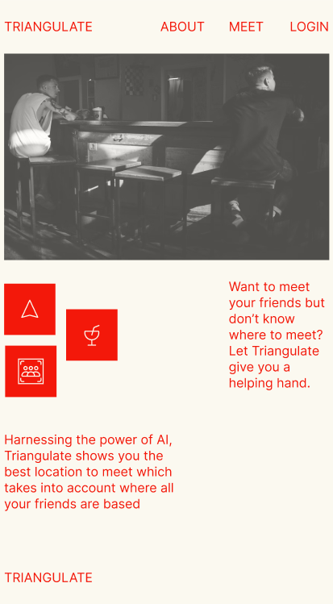
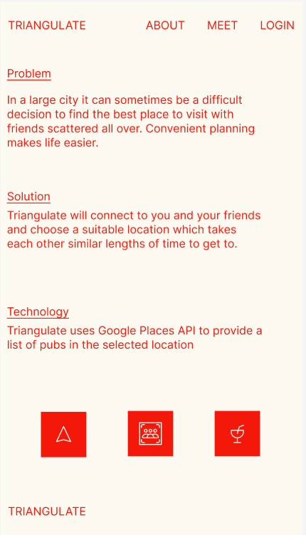
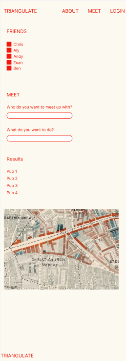
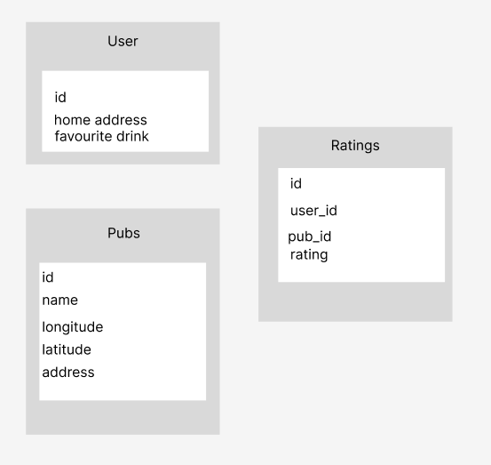

# Project Title

Triangulate

## Overview

Triangulate offers you the opportuntity to find and rate pubs located around your city, while allowing you to find places closest to you and your friends.

### Problem

Triangulate offers the convenience of planning your pub visits for you and friends, allowing you all to visually see where is best to go to. The rating feature allows each user to keep a track of how much they enjoyed each pub, incorporating this feedback into where they go to in future.

When looking for a pub to go to, Traingulate cuts out the time consuming process of conducting a Google Search and then checking with all your friends to see what pub location is best to get to for everyone. All the data you need is in one place and you can check on behalf of your friends too, as you'll be able to see where they are located.

### User Profile

- Pub goers:
  - people looking for the nearest and best pub to visit
  - people looking for a hangout spot located conveniently for all friends
  - people looking to rate pub experiences for tracking and future planning purposes

### Features

- As a user, I want to view a map of all the pubs I've been to in my city so that I can see where I've been to and discover new places to

- As a user, I want to have the ability to add new pubs to the map, including details such as name, location, and my personal rating

- As a user, I want to be able to see reviews and ratings of pubs from other users, helping me make informed decisions about which pub to visit

- As a user, I want to create a profile and add friends so that I can easily coordinate and plan pub outings with them

- As a user, I want to see my friends' locations on the map in real-time so that I can easily find friends nearby for impromptu plans

- As a user, I want to select specific friends and view the distance and estimated time it will take for each friend to reach a selected pub

- As a user, I want a feature that automatically plans a pub crawl route for me, considering the locations of pubs and friends

## Implementation

### Tech Stack

- React.js
- MySQL
- Node.js
- Client libraries:
  - react
  - react-router-dom
  - axios
  - sass
  - mapbox-gl
  - react-geolocated
  - geolib
- Server libraries:
  - knex
  - express
  - bcrypt for password hashing

### APIs

- Creating own API from my friends Google Doc of pubs he's visited

### Sitemap

- Home
- About
- Meet
- Register
- Login

### Mockups

#### Home Page

#### About Page

#### Meet Page

#### Login Page

### Data

#### Login Page

### Endpoints

**GET /pubs**

Parameters:

- homeAddress: user input during login
- longitude: converted from home address
- latitude: converted from home address

Response:

    {
        "id": 1,
        "name": "Earl of Essex",
        "distance": 0.25,
        "rating": 35,
    }

**GET /pubs/:id**

- Get pub by id

Parameters:

- id: pub id as number

Response:

    {
        "id": 1,
        "name": "Earl of Essex",
        "distance": 0.1,
        "rating": 35,
    }

**POST /pubs/:id/rating**

- Logged in user can add their rating of a pub

Parameters:

- id: pub id
- token: JWT of the logged in user
- rating: number rating out of 50 in 0.5 increments

Response:

    {
        "id": 1,
        "name": "Earl of Essex",
        "distance": 0.1,
        "rating": 35,
    }

**PUT /pubs/:id/rating**

- Logged in user can update their rating of a pub

Parameters:

- id: pub id
- token: JWT of the logged in user
- rating: number rating out of 40 in 0.5 increments

Response:

    {
        "id": 1,
        "name": "Earl of Essex",
        "distance": 0.1,
        "rating": 35,
    }

**POST /users/register**

- Add a user account

Parameters:

- email: user's email
- password: user's provided password

Response:

    {
        "token": "hbcJhbGciOiJIUzI1NiIsInR5cCI6IkpXVCJ9.eyJzdWIiOiIxMjM0NTY3ODkwIiwibmFtZSI6I..."

        }

**POST /users/login**

- Login a user

Parameters:

- email: user's email
- password: user's provided password
- homeAddress: user's provided home address

Response:

    {
    "token": "hbcJhbGciOiJIUzI1NiIsInR5cCI6IkpXVCJ9.eyJzdWIiOiIxMjM0NTY3ODkwIiwibmFtZSI6I..."
    }

### Auth

See below in Nice-to-haves

## Roadmap

- Figma files
- Server side function running
- Build APIs for Friends and Pubs
- Build out Mapbox functionality
- Create Database and transfer Friends and Pubs data over to it

## Nice-to-haves

- User authentication and login
- Calculate pub crawl based on distance between pubs
- Weather API - for pub crawl feeature
